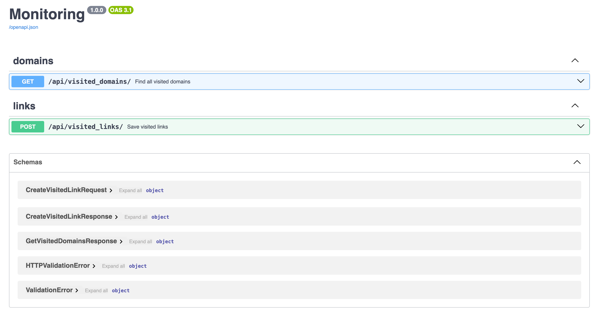

## Описание
Данный wеb-сервис предназначен для учета посещенных ресурсов интернета работниками компании.

## Требования для запуска сервиса
Наличие локально установленного сервиса Docker.

## Запуск приложения
Выполни из корня проекта:
```bash
docker-compose up --build
docker-compose up
```

## Запуск тестов
```bash
docker exec -it $(docker ps -a -q -f name=visited_links-server-1) bash
pytest -v
```

## Использование приложения

### api/visited_links/
```bash
curl -X 'POST' \
  'http://0.0.0.0:8000/api/visited_links/' \
  -H 'accept: application/json' \
  -H 'Content-Type: application/json' \
  -d '{
"links": [
"https://ya.ru/",
"https://ya.ru/search/?text=мемы+с+котиками",
"https://sber.ru",
"https://stackoverflow.com/questions/65724760/how-it-is"
]
}'
```

### api/visited_domains/
```bash
curl -X 'GET' \
  'http://0.0.0.0:8000/api/visited_domains/' \
  -H 'accept: application/json'
```

## Нагрузочное тестирование
Тестирование выполняется с помощью Vegeta.

Установи Vegeta с помощью Homebrew:
```bash
brew update && brew install vegeta
```

## Тестирование API endpoint

### api/visited_links/
```bash
vegeta attack -duration=10s -rate=100 -targets=visited_links_target.list -output=attack-visited-links.bin
vegeta plot -title=AttackResults attack-visited-links.bin > attack-visited-links-results.html
```
[Результаты](attack-visited-links-results.html) 


### api/visited_domains/
```bash
vegeta attack -duration=10s -rate=100 -targets=visited_domains_target.list -output=attack-visited-domains.bin
vegeta plot -title=AttackResults attack-visited-domains.bin > attack-visited-domains-results.html
```
[Результаты](attack-visited-domains-results.html)

## Остановка приложения
Нажми в терминале  Ctrl+C.

##  Документация
Доступна по адресу http://0.0.0.0:8000/docs#/ (контейнер приложения прежде должен быть запущен).


